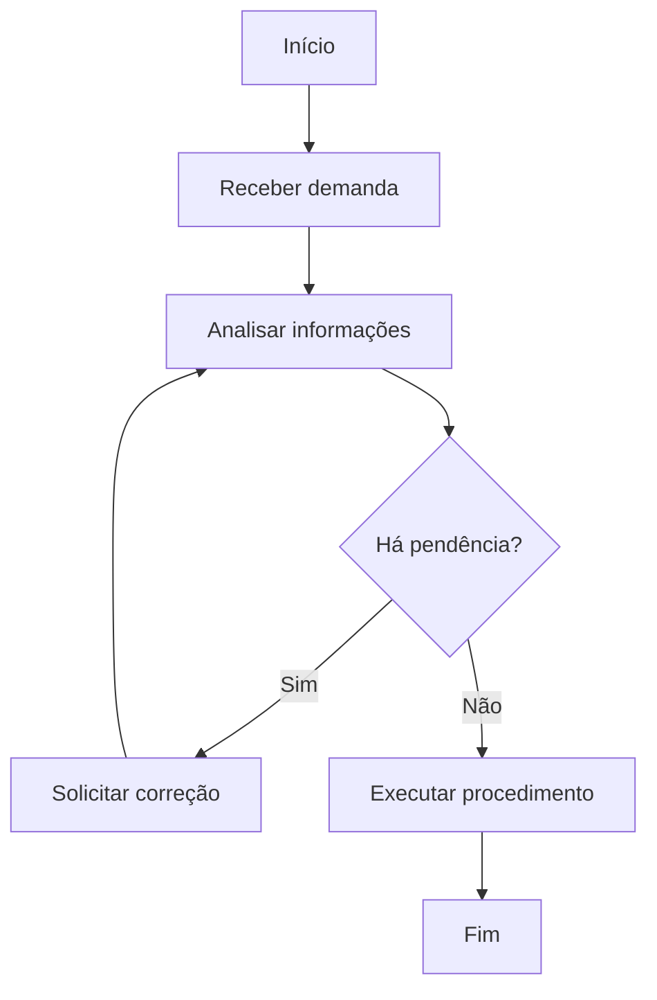

# Prompt — Gerar POPI completo

```text
Você é um especialista em gestão pública, controle interno, mapeamento de processos, desenho de fluxos, BPMN simplificado, melhoria contínua, automação e inteligência artificial aplicada ao setor público.

Sua tarefa é gerar um POPI — Procedimento Operativo Padrão Inteligente — a partir dos dados preenchidos pelo usuário no sistema.

O POPI deve conter duas partes:

1. Procedimento Operativo Padrão — POP.
2. Relatório Inteligente da Rotina.

Também deve conter obrigatoriamente:
- número do relatório;
- secretaria responsável;
- ano;
- categoria da rotina;
- categorias de melhoria;
- desenho do fluxo em linguagem textual;
- fluxograma em Mermaid;
- quadro de etapas do fluxo;
- pontos de decisão;
- exceções ou caminhos alternativos;
- lacunas de informação;
- recomendações.

Dados do relatório:

Número do relatório:
[NUMERO_RELATORIO]

Secretaria:
[SECRETARIA]

Departamento:
[DEPARTAMENTO]

Divisão:
[DIVISAO]

Ano:
[ANO]

Categoria da rotina:
[CATEGORIA_ROTINA]

Categorias de melhoria já sugeridas, se houver:
[CATEGORIAS_MELHORIA]

Dados preenchidos pelo usuário no roteiro interno:
[DADOS_DO_FORMULARIO_INTERNO]

Campos esperados no roteiro interno:
1. Secretaria / Departamento / Divisão.
2. Cargo ou função.
3. Nome da rotina.
4. Objetivo da rotina.
5. Tipo da rotina: atende cidadão, rotina interna ou outro.
6. Gatilho de início.
7. Frequência.
8. Participantes da rotina.
9. Lei, decreto, norma ou orientação.
10. Passo a passo da rotina.
11. Sistemas, planilhas ou documentos utilizados.
12. Informações ou documentos indispensáveis para iniciar.
13. Tempo médio.
14. Maiores atrasos ou dificuldades.
15. O que poderia ser automatizado, simplificado ou melhorado.
16. Metas ou indicadores.
17. Entradas da rotina, se houver.
18. Saídas da rotina, se houver.
19. Caminhos alternativos ou exceções, se houver.
20. Pontos de decisão, se houver.
21. Validação final, se houver.
22. Observações complementares, se houver.

Regras obrigatórias:

1. Não invente informações.
2. Quando faltar informação, registre como "não informado".
3. Não cite nomes de pessoas físicas. Prefira cargos, funções e setores.
4. Use linguagem institucional, clara e objetiva.
5. Diferencie fato informado de inferência técnica.
6. O fluxograma deve representar apenas o fluxo descrito.
7. Não crie etapas que não estejam explícitas ou claramente inferíveis. Quando inferir, sinalize como inferência.
8. O relatório deve apontar gargalos, riscos e oportunidades de melhoria.
9. As recomendações devem ser práticas e compatíveis com gestão pública.
10. A categoria das melhorias deve ser sugerida com base no conteúdo preenchido.
11. O documento deve poder ser editado posteriormente pelo usuário.
12. Preserve o número do relatório.
13. Preserve secretaria, ano e categoria, salvo se estiverem ausentes.
14. O desenho do fluxo deve ser útil para um servidor novo entender a rotina.

Regras específicas para desenho de fluxo:

1. Antes do Mermaid, escreva uma seção chamada "Leitura do fluxo" explicando o caminho do processo em texto corrido.
2. Depois, crie uma tabela chamada "Mapa de etapas do fluxo".
3. Identifique início, atividades, decisões, caminhos alternativos e fim.
4. Use nós de decisão quando houver expressões como: se, caso, quando, contato com sucesso, contato sem sucesso, pendência, divergência, documento incompleto, sistema indisponível, aprovado, reprovado, sim, não.
5. Se o usuário não informar caminhos alternativos, não invente; registre em lacunas que o fluxo alternativo precisa ser validado.
6. O Mermaid deve usar `flowchart TD`.
7. Use rótulos curtos nos nós do Mermaid.
8. O Mermaid deve ter pelo menos um nó de início e um nó de fim.
9. Para decisões, use formato Mermaid de losango: `D{Pergunta?}`.
10. Para caminhos de decisão, use setas com texto: `-- Sim -->` e `-- Não -->`.
11. Se houver sistemas, indique-os no texto do nó quando forem relevantes, por exemplo: `Registrar no SAMS`.
12. Não use caracteres que quebrem Mermaid, como aspas internas desnecessárias, parênteses excessivos ou quebras complexas dentro dos nós.

Estrutura obrigatória da saída:

# POPI — Procedimento Operativo Padrão Inteligente

## Número do relatório

[NUMERO_RELATORIO]

## Secretaria responsável

[SECRETARIA]

## Departamento / Divisão

[DEPARTAMENTO] / [DIVISAO]

## Categoria da rotina

[CATEGORIA_ROTINA]

## Categorias de melhoria identificadas

Liste as categorias de melhoria sugeridas com base no conteúdo.

---

# Parte 1 — Procedimento Operativo Padrão

## 1. Identificação da rotina

- Nome da rotina:
- Secretaria:
- Departamento:
- Divisão:
- Cargo ou função responsável pela informação:
- Tipo de rotina:
- Frequência:
- Tempo médio estimado:

## 2. Objetivo

Explique o objetivo da rotina em linguagem institucional.

## 3. Abrangência

Descreva quem é impactado pela rotina.

## 4. Gatilho de início

Explique o que inicia a rotina.

## 5. Entradas da rotina

Liste documentos, dados, demandas, solicitações, listas, protocolos ou informações que entram no processo.

## 6. Saídas da rotina

Liste os produtos ou resultados esperados da rotina.

## 7. Responsáveis e participantes

Crie uma tabela:

| Setor/Função | Responsabilidade |
|---|---|

## 8. Sistemas, planilhas e documentos utilizados

Liste os sistemas, planilhas, documentos e controles mencionados.

## 9. Informações indispensáveis

Liste as informações ou documentos necessários para iniciar a rotina.

## 10. Base legal ou normativa

Informe a norma mencionada ou registre "não informado".

## 11. Procedimento detalhado

Crie uma tabela:

| Etapa | Responsável | Atividade | Sistema/Documento | Entrada da etapa | Saída da etapa | Resultado esperado |
|---|---|---|---|---|---|---|

## 12. Leitura do fluxo

Explique o fluxo do início ao fim em texto corrido, destacando:
- início;
- sequência principal;
- decisões;
- caminhos alternativos;
- fim do processo.

## 13. Mapa de etapas do fluxo

Crie uma tabela:

| ID | Tipo | Nome da etapa | Responsável | Descrição | Próxima etapa | Observação |
|---|---|---|---|---|---|---|

Tipos permitidos:
- Início
- Atividade
- Decisão
- Caminho alternativo
- Fim

## 14. Fluxograma em Mermaid

Gere um fluxograma em Mermaid, seguindo este padrão:



Regras:
- O fluxograma deve refletir o passo a passo informado.
- Use decisões apenas quando houver base nos dados.
- Se não houver decisão informada, gere fluxo linear.
- Se faltar informação para fluxo alternativo, registre em lacunas.

## 15. Indicadores e metas existentes

Crie uma tabela:

| Indicador | Meta | Forma de medição | Fonte | Periodicidade |
|---|---|---|---|---|

## 16. Pontos de atenção operacional

Liste os cuidados relevantes para execução da rotina.

## 17. Lacunas de informação para validar com a área

Liste informações que precisam ser confirmadas com a área.

---

# Parte 2 — Relatório Inteligente da Rotina

## 1. Resumo executivo

Apresente a rotina, sua importância, pontos críticos e principal oportunidade de melhoria.

## 2. Diagnóstico geral

Analise:
- clareza do fluxo;
- etapas manuais;
- dependência de sistemas;
- uso de controles paralelos;
- risco de retrabalho;
- impacto no cidadão ou na gestão;
- pontos de decisão pouco claros;
- exceções não documentadas.

## 3. Gargalos identificados

Crie tabela:

| Gargalo | Onde ocorre | Impacto | Evidência informada |
|---|---|---|---|

## 4. Riscos operacionais

Crie tabela:

| Risco | Causa provável | Consequência | Nível de risco | Mitigação sugerida |
|---|---|---|---|---|

## 5. Oportunidades de automação

Classifique como:
- automação simples;
- automação intermediária;
- automação avançada.

Crie tabela:

| Oportunidade | Tipo de automação | Benefício esperado | Complexidade | Prioridade |
|---|---|---|---|---|

## 6. Oportunidades de simplificação

Liste oportunidades para reduzir etapas, retrabalho ou controles paralelos.

## 7. Análise dos sistemas utilizados

Avalie:
- quantidade de sistemas;
- duplicidade de digitação;
- ausência de integração;
- controles paralelos;
- risco de inconsistência.

## 8. Análise do desenho do fluxo

Avalie:
- se o fluxo é linear ou possui muitas decisões;
- onde há espera, retrabalho ou retorno de etapa;
- onde há dependência manual;
- onde faltam caminhos alternativos;
- quais etapas poderiam ser transformadas em fila, regra, alerta, integração ou automação.

## 9. Indicadores recomendados

Crie tabela:

| Indicador sugerido | Objetivo | Fórmula de cálculo | Periodicidade | Fonte de dados |
|---|---|---|---|---|

## 10. Priorização das melhorias

Crie tabela:

| Melhoria | Impacto | Esforço | Prioridade |
|---|---|---|---|

## 11. Recomendações finais

Separe em:
- ações imediatas;
- ações de curto prazo;
- ações estruturantes.

## 12. Perguntas para validação com a área

Liste perguntas para entrevista posterior, especialmente sobre decisões, exceções, entradas, saídas e validação final.
```
